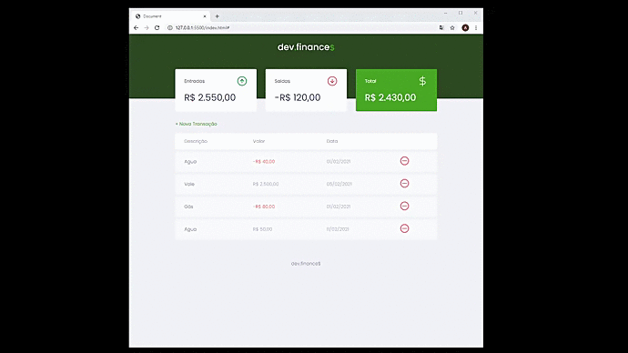

<!---------- Title/ Logo -------------->
<h1 align="center">
  
</h1>

<!-- ------- Ancoras --------------->
<p align="center">
  <a href="#-sobre">Sobre</a>&nbsp;&nbsp;&nbsp;|&nbsp;&nbsp;&nbsp;
  <a href="#-projeto">Projeto</a>&nbsp;&nbsp;&nbsp;|&nbsp;&nbsp;&nbsp;
  <a href="#-telas">Telas</a>&nbsp;&nbsp;&nbsp;|&nbsp;&nbsp;&nbsp;
  <a href="#-tecnologias">Tecnologias</a>&nbsp;&nbsp;&nbsp;|&nbsp;&nbsp;&nbsp;
  <a href="#-layout">Layout</a>&nbsp;&nbsp;&nbsp;|&nbsp;&nbsp;&nbsp;
  <a href="#-licença">Licença</a>
</p>

<!---------- Badges ----------------->  
<p align="center">
  <!--  -->

  
  <!-- 
   -->

  

  <!--  -->
 
  

  
  <!--   -->
  <!-- --(4953b8)--blueDark -->
  <!-- --(49AA26)--Green -->
  <!-- --(3292a6)--BlueMedium-->
 </p>

<br>

<!---------- showcase  ----------------->  
<p align="center">
  
</p>

<!----- Acess Deploy Demonstration-->
 <h5 align="center">
    🎬 Clique Aqui: &nbsp; <a href="https://dev-finance-seven.vercel.app/">  Visualizar Demonstração </a> 
 </h5>

<!----- Description ------------------>

## 🔖 Sobre
&nbsp;&nbsp;&nbsp;&nbsp;Este Projeto faz parte de um evento do qual tive a oportunidade de participar, onde foi sugerido a **Maratona-Discovery** da Rocketseat, foi  uma maratona de estudos sobre Programação com foco em Desenvolvimento Web, onde o objetivo principal é mostrar como é simples desenvolver projetos web. Nesta edição desenvolveremos um projeto denominado dev.finance$, um site responsivo de controle financeiro.

&nbsp;&nbsp;&nbsp;&nbsp;Nesta Maratona pude aprender mais sobre as seguintes técnologias e partilhar conhecimentos com diversos outros desenvolvedores com objetivo principal de criação deste sistema: **dev.Finance$** que é uma aplicação Web e Mobile possibilitando aos usuários realizar um controle de suas transações financeiras, obtendo uma gestão de seus ganhos e gastos pessoais.

<br>

## 💻 Projeto

 &nbsp;&nbsp;&nbsp;&nbsp;O **dev.finance$** é uma aplicação de controle financeiro, onde é possível cadastrar e excluir transações e ver o saldo de entrada e saída 💰.

<br>

###### **Evento :** Maratona -Discovery 1ª Edição - [Rocketseat](https://rocketseat.com.br)
###### **Instrutor :** Mayk Brito
<br>

<!----- Showcase Screens Shot------------------>

## 💻 **Telas**

<div align="center">

<br>
 
 
</div>
<br>
<br>

<!----- Configurations ---------------------------->
## 📌 Instruções : 
 &nbsp;&nbsp;&nbsp;&nbsp;Para iniciar o Servidor da aplicação utilizando o **VsCode** use o comando: **_Open Whit Live Server_** então acesse pelo navegador **_http://127.0.0.1:5500/index.html_** .

<br>

<!----- Configurations ---------------------------->
## 🚀 **Tecnologias**
 
- [HTML5](https://pt.wikipedia.org/wiki/HTML5) - Hyper Text Markup Language -linguagem de marcação de hipertexto.
- [CSS3](https://pt.wikipedia.org/wiki/CSS3) - Cascading Style Sheets - estilização de código html.
- [Java Script](https://www.javascript.com/) -  Linguagem de programação utilizada em páginas web. Com o JS.
- [VS Code](https://code.visualstudio.com/) - Editor de desenvolvimento de aplicações web.

<br>

## 🔖 Layout

 &nbsp;&nbsp;&nbsp;&nbsp;Você pode visualizar o layout do projeto através [desse link](https://www.figma.com/file/7Vu9DzUaCZIV4nibzkjgB4/dev.finance%24-Maratona-Discover). É necessário ter conta no [Figma](https://figma.com) para acessá-lo.

<br>

## 📝 Licença

&nbsp;&nbsp;&nbsp;&nbsp;Esse projeto está sob a licença MIT. Veja o arquivo [LICENSE](LICENSE.md) para mais detalhes.

<br>

## 📁 Como Baixar o Projeto
```bash
  # Clonar o repósitorio
  $ git clone https://github.com/alxlima/DevFinance.git
  
  # Entrar no diretório
  $ cd c:/maratona-discover

  # Instalar as dependências
  $ npm install
  
  # Iniciar o Projeto
  $ npm start
```
---
 Desenvolvido 🚀 por: ***_Alex Sandro da Silva lima_***


[](https://www.linkedin.com/in/alex-sandro-da-silva-lima-8b297839/) 
[](mailto:alex_lima2013@hotmail.com)
